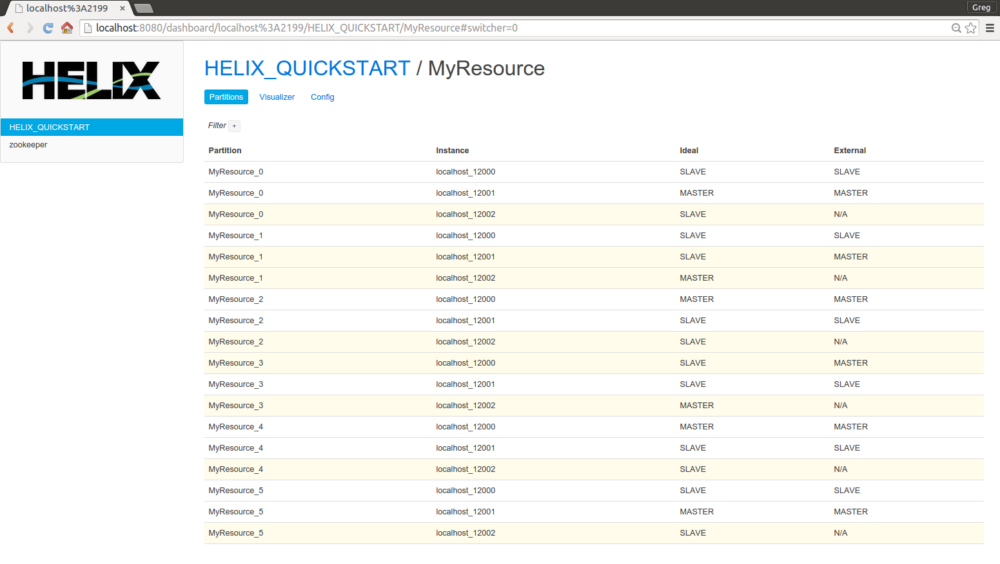
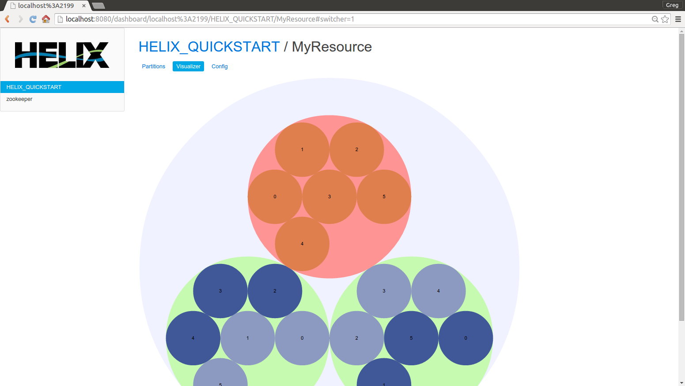
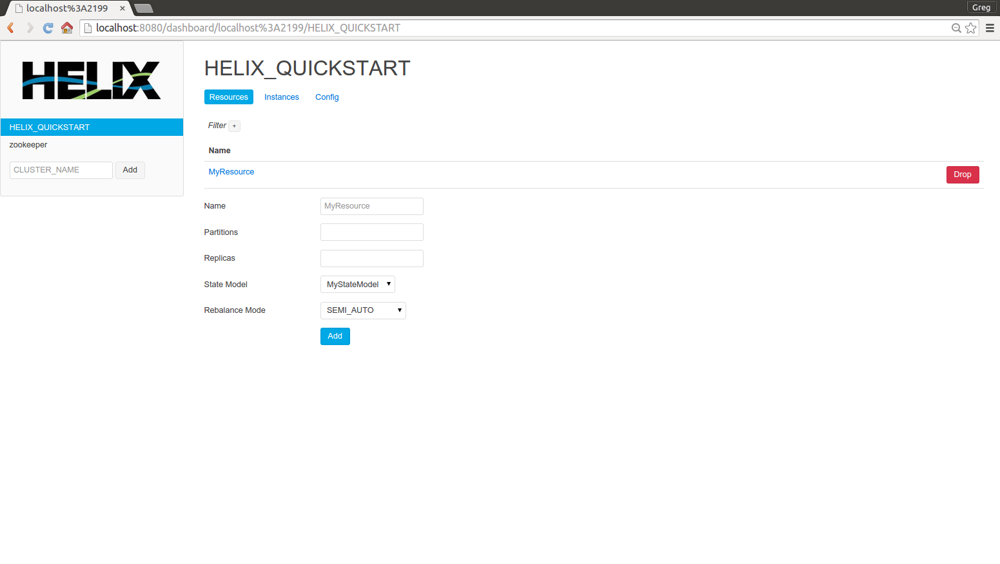
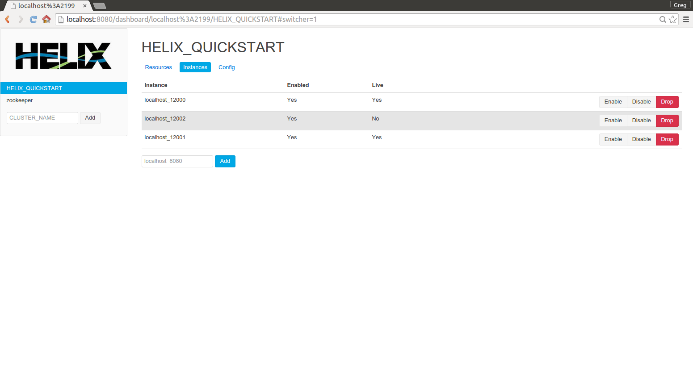

# helix-ui

After building the project from the root directory (i.e. `./build`), find the
`helix-ui-${version}.jar` artifact in this module's `target` directory.

To run the UI server in read-only mode with no configuration, execute the
following commands:

```
java -jar helix-ui-${version}.jar server
```

Navigate to `http://localhost:8080/dashboard` to get started. At this page,
enter a ZooKeeper address, e.g. "localhost:2181,localhost:2182" or
"some-machine:2181/chroot", to get started.

The following shows using the dashboard to view the end state of MyResource in
the Quick Start, in tabular form:



And using visualization:



## Admin

In order to run the server in admin mode, set `adminMode: true` in the
application configuration. 

To restrict the ZooKeeper machines that the UI will try to connect to, use the
`zkAddresses` configuration parameter. The application will never try to
connect using a ZooKeeper connection string that contains machines not in that
list.

When the server is configured to run in admin mode, several buttons to perform
actions like add / drop resource, add / enable / disable / drop instance, etc.
are rendered on the UI at appropriate locations.

The following shows the admin resource view:



And the following shows the admin instance view:



## Configuration

For example, the following configuration runs the server in admin mode, only
connecting to "localhost:2181", on ports 60000 for normal application traffic,
and 60001 for admin actions:

```
adminMode: true

zkAddresses:
  - "localhost:2181"

server:
    applicationConnectors:
        - type: http
          port: 60000
    adminConnectors:
        - type: http
          port: 60001
```

If this configuration exists in a file named `/tmp/my-config.yml`, one would
run the server in the following way:

```
java -jar helix-ui-${version}.jar server /tmp/my-config.yml
```

For more details on configuration, see [Dropwizard Configuration
Reference](https://dropwizard.github.io/dropwizard/manual/configuration.html)
